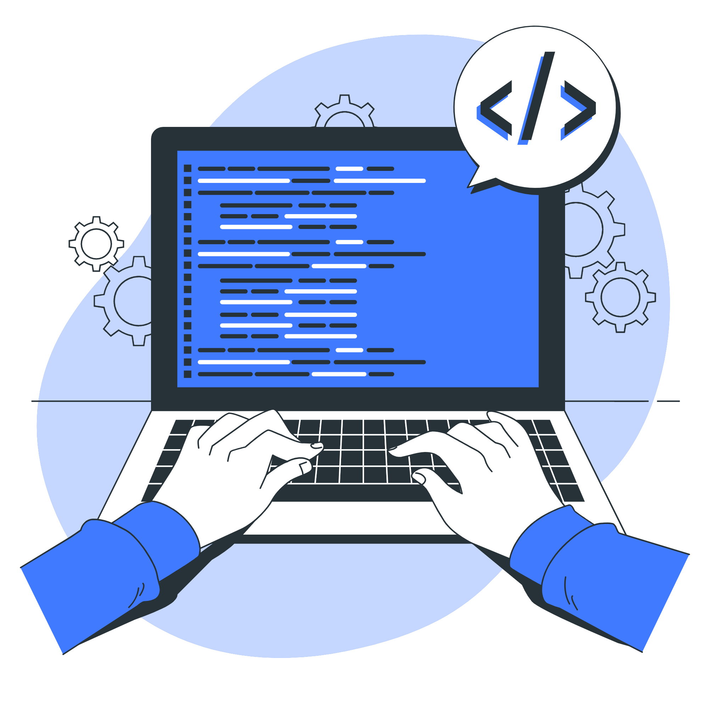

## Hi there👋, I'm <a>[Chirag Taneja!](https://www.linkedin.com/in/chirag-taneja-b647981a4/)

<!-- Image -->

 
<!-- About Me -->
 #### About Me

- 👨‍💻 Full Stack Developer. 
- 📫 How to reach me **chiragtaneja915@gmail.com**
 
---
<!-- Languages, Frameworks and Tools -->
#### Languages, Frameworks and Tools:

 

 
<!-- Connect with me: -->
#### Connect with me:

<a href="mailto:chiragtaneja915@gmail.com">

 

 
<!-- Github Statistics -->
#### Github Statistics:

 

