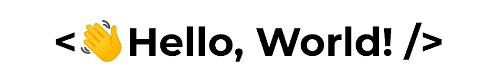

<!-- 

 -->

<h1 align="center">Hi  👋 <!--  -->,
 I'm <a href="https://www.linkedin.com/in/chirag-taneja/" target="_blank">
Chirag 👨‍💻</a></h1>

Web Dev | Mobile Dev

<!-- 
Master of Computer Applications (MCA) 
 -->

<!-- 
 -->

<!-- Image -->

 
<!-- About Me -->
 #### About Myself
- Employment ... **Open for better full-time offers**
- I will graduate in 2024 from DIT University, Dehradun (MCA).
- I’m currently learning **ReactJs and React Native**.
- I’m looking to collaborate on projects based on ReactJs, and React Native.
-  All of my projects are available at [https://github.com/dev-chirag-taneja](https://github.com/dev-chirag-taneja).
- Ask me about **ReactJs, React Native**
- How to reach me **chiragtaneja915@gmail.com**.
 
<!-- --- -->

<!-- Languages and Frameworks -->
<h4 align="center">Languages and Frameworks </h4>

<!-- Github Statistics -->
### Github Statistics
<!-- 
 -->

<table align="center" border="0" cellpadding="0" cellspacing="0">
    <thead>
        <tr>
            <td>             </td>
            <td></td>
        </tr>
    </thead>
</table>

###   Let's stay connected!
<!-- 
 -->

<a href="mailto:chiragtaneja915@gmail.com">

<!--

 -->

 
